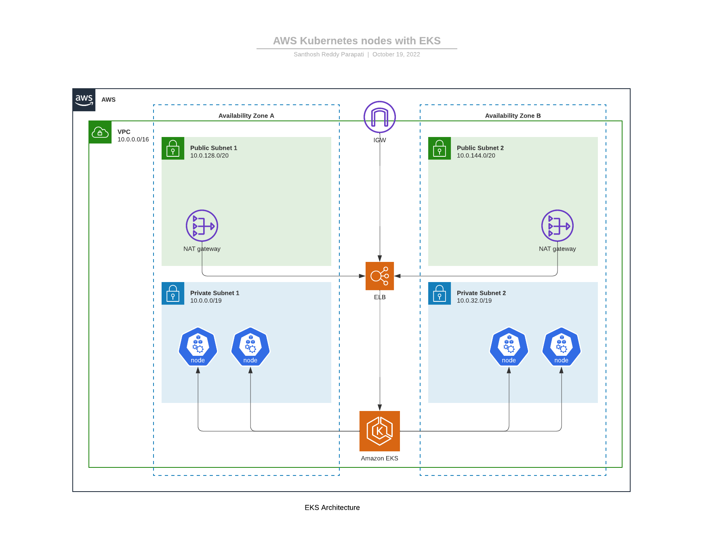
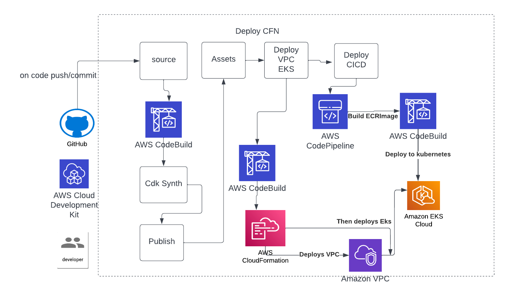

## Word Replacement API

## Overview

This project uses CDK Pipelines to define a self mutating pipeline to deploy and manage EKS Cluster(s) and Deployments . It uses CDK for cluster, node, infrastructure and app configuration.
 
### Pipeline
 



 

### Project Structure
word_replacer_api
    - word_replacer_api (API Gateway + Word Replacer Lambda + Authorization Lambda )
        - word_replacer_api_stack
        - lambda_code
    - word_replacer_eks_api (EKS Cluster + CICD Piplene to deploy Infra and app on K8s cluster)
        - ci_cd
            - pipeline (Deploying VPC and EKS Stacks)
            - ci_cd (Deploying CICD pipeline for word_replacer_api on K8s)
        - infra 
            - vpc (cdk code)
            - eks (cdk code)
        - word_replacer_app
            - code for api 
            - kubernetes deploy manifest file


### App

- Deployment
- Service
- Ingress

### DNS

- Route53 (Need to be added )

## Deployment

To deploy the pipeline for the first time, you'll need to  deploy it using `cdk deploy`. After the first deploy, any change that you push to your Git Repository will update the Pipeline and execute.
 

## Instrustions
To manually create a virtualenv on MacOS and Linux:

```
$ python -m venv .venv 
$ source .venv/bin/activate
% .venv\Scripts\activate.bat
$ pip install -r requirements.txt
```
At this point you can now synthesize the CloudFormation template for this code.

```
$ cdk synth
```

To add additional dependencies, for example other CDK libraries, just add
them to your `setup.py` file and rerun the `pip install -r requirements.txt`
command.

## Useful commands

 * `cdk ls`          list all stacks in the app
 * `cdk synth`       emits the synthesized CloudFormation template
 * `cdk deploy`      deploy this stack to your default AWS account/region
 * `cdk diff`        compare deployed stack with current state
 * `cdk docs`        open CDK documentation

Enjoy!
